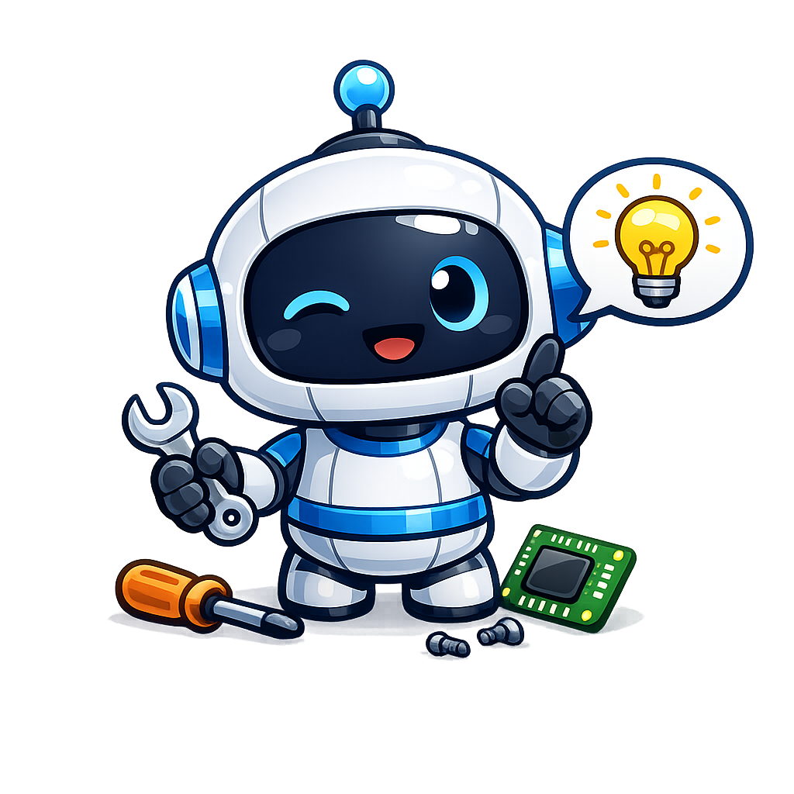

  

  

    

  

      <h1 class="hub-title">Choisis ton jeu</h1>

  

    
  

    

    <h2>Fallout 4</h2>
  

  

    

    <h2>Fallout London</h2>
  

  

    

    <h2>New Vegas</h2>
  

  
  

    

    <h2>TTW</h2>
  

  
  

    

    <h2>Cyberpunk 2077</h2>
  

        
   

   

  

<!-- PANEL JEU -->

  

    <h1 id="game-title"></h1>
    

      <a id="guide-text" class="btn-hub-large btn-orange">Guide Écrit</a>
      <a id="guide-video" class=""btn-hub-large btn-red" target="_blank">Guide Vidéo</a>
    

  

