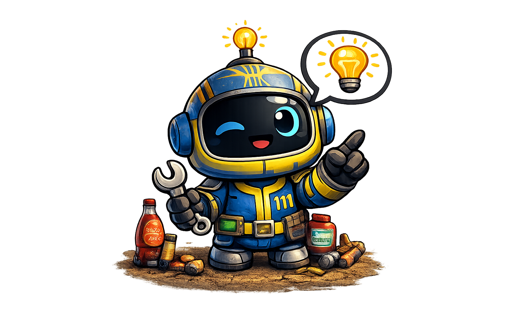

    <!-- Fond plein écran -->
    

  

        

  

            <h1 class="hub-title">Bienvenue dans le Commonwealth</h1>

            <!-- Grid des jeux -->
  

                <a href="fallout4/" class="game-card">
                    

                    
<h2>Fallout 4</h2>

                </a>
                <a href="fallout-london/" class="game-card">
                    

                    
<h2>Fallout London</h2>

                </a>
                <a href="fnv/" class="game-card">
                    

                    
<h2>New Vegas</h2>

                </a>
                <a href="ttw/" class="game-card">
                    

                    
<h2>TTW</h2>

                </a>
                <a href="cyberpunk/" class="game-card">
                    

                    
<h2>Cyberpunk 2077</h2>

                </a>
            

        

    

