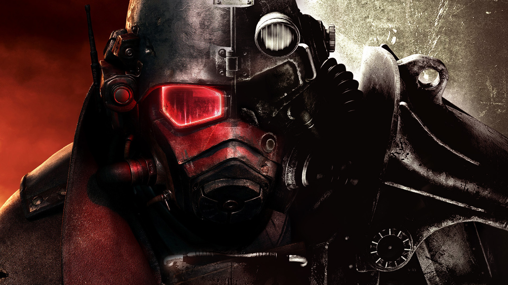

    

  

        
        <h1 class="hub-main-title" id="hubTitle">Choisissez votre univers</h1>
        
  

            

                Fallout 4
            

            

                Fallout London
            

            

                New Vegas
            

            

                TTW
            

            

                Cyberpunk 2077
            

        

   

            

                <a href="#" id="linkWritten" class="btn-hub-large btn-orange">
                    <i class="fas fa-book"></i> Guide Écrit
                </a>
                <a href="#" id="linkVideo" target="_blank" class="btn-hub-large btn-red">
                    <i class="fab fa-youtube"></i> Guide Vidéo
                </a>
            

            <button class="btn-back" onclick="resetHub()">← Retour au menu</button>
        

    

